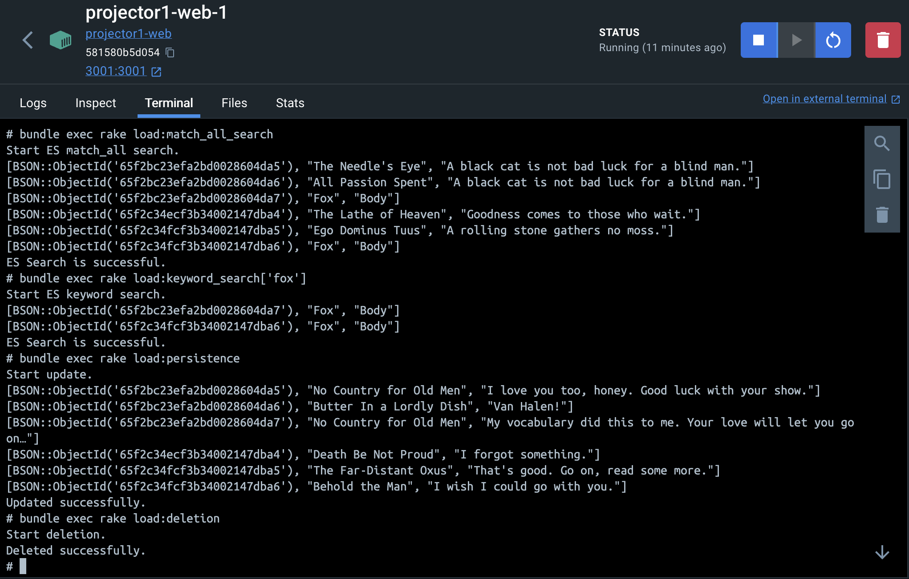
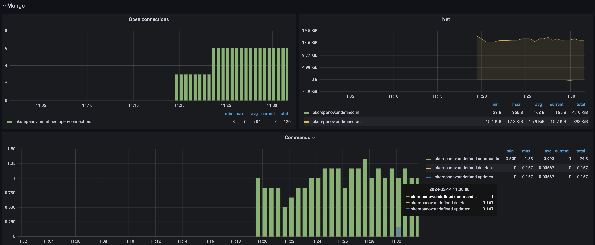
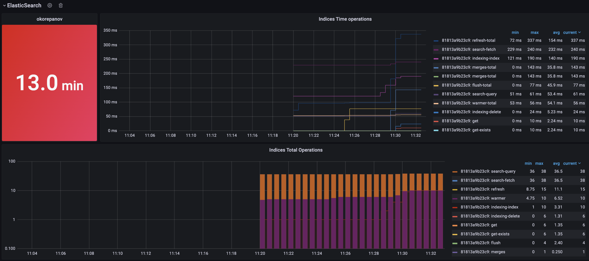
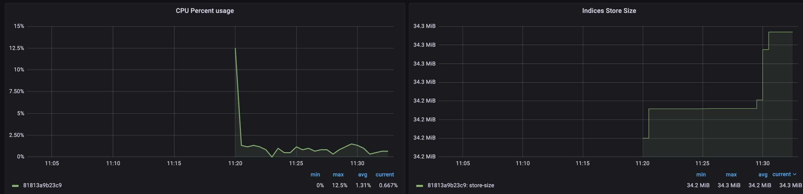

# README

## Rake tasks for load testing
1. `bundle exec rake load:creation[CREATE_COUNT]` - pass `CREATE_COUNT` to specify number of random Posts to be created. Additionally one fake Posts will be created for search purposes.
2. `bundle exec rake load:persistence` - update all Posts with random attributes
3. `bundle exec rake load:deletion` - delete all Posts
4. `bundle exec rake load:match_all_search` - ES search with `match_all: {}` query
5. `bundle exec rake load:keyword_search[QUERY]` - ES search with specified `QUERY`

## Monitoring screenshots
### Application load using rake tasks (creation, persistence, deletion and ES search)

### Mongo

### Elasticsearch

